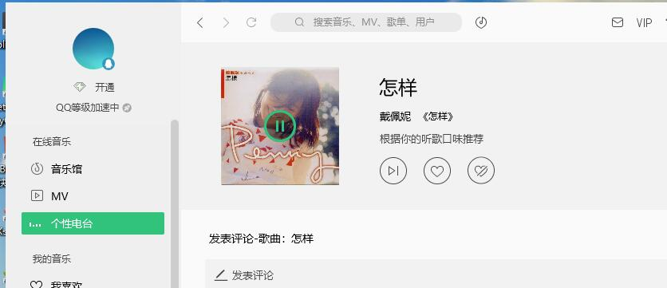

访问：

没登录 get http://127.0.0.1 -->login.html

登录 get http://127.0.0.1 -->index.html

令牌：

1.注册

2.登录（给一个标识符）

​	a.登录向页面的cookie中添加标识符：set_cookie(key,value,max_age)

​	b.向后端的usertoken表中存入这个标识符和登录用户

3.访问任何路由，先校验你的标识符是否正确，如果正确就放行，否则就拒绝

​	使用的是闭包（特殊的装饰器）

4.注销

a.删除页面cookie中的标识符;delete_cookie(key)

b.删除后端usertoken表中标识符对应的那一条数据


中午作业：

1.创建项目day05,创建应用user,修改setting.py ,包括数据库

2.定义模型

class user() : 字段自己想

class usertoken()：标识符 用户 什么关系？


```
__init__.py #空python脚本，存在的目的是告诉python解释器，这个目录时一个python包
setting.py #存放django项目的设置
urls #存放项目url
wsgi.py #用于运行开发服务器和把项目部署到生产环境的python脚本
```

```
python manage.py runserver
命令启动python，让Django运行内置的轻量开发服务器，开发服务器地址http://127.0.0.1:8080/,一般不要设置为8080，这是为http保留的
```

新建项目

python manage.py startapp app

```
__init__.py 和前面一样
admin.py 注册模型
apps.py 当前应用配置
models.py 存放应用的数据模型，数据实体与其之间关系
tests.py 存放测试应用代码的函数
views.py 存放处理请求并返回响应的函数
migrations目录 存放和模型有关的数据库信息

```

```
from django.http import HttpResponse
def index(request):
	return HttpResponse('Rango says hey there partner')
	
	首先，从django.http模块中导入HttpResponse对象
	在views.py文件中，一个函数就是一个视图，这里视图index
	视图有一个参数，HttpResponse对象，它也在django.http中
	这个参数名叫request
	视图会返回一个HttpResponse对象,简单的HttpResponse对象的参数是一个字符串，表示要发给客户端的页面内容
	
	有视图还不行，为了让用户能访问，需要一个统一资源定位符url,映射到视图上，为此,打开urls
	from rango import views
	urlpatterns=[
      url(r'^admin/',views.index,name='index')
	]
	新加的那行代码把url映射到rango应用的index视图上，启动开发器访问地址，可以看到index视图渲染的输出
```





