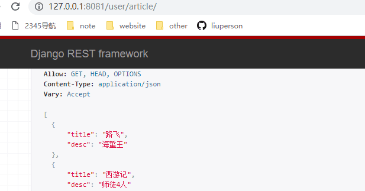
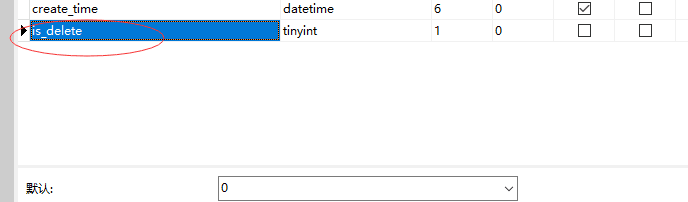

[toc]


# restful

## 1.restful

  Representational State Transfer，翻译是”表现层状态转化”。

+ **REST：**

  所有Web应用都应该遵守的架构设计指导原则:

+ **核心：**

  **a.资源:**

  是REST最明显的特征,是指对某类信息实体的抽象，资源是服务器上一个可命名的抽象概念，资源是以名词为核心来组织的，首先关注的是名词。

  **b.状态转移:** 

  是指客户端痛服务端进行交互的过程中，客户端能够通过对资源的表述，实现操作资源的目的

  **c.统一接口:** 

  REST要求，必须通过统一的接口来对资源执行各种操作。对于每个资源只能执行一组有限的操作。 比如，客户端通过HTTP的4个请求方式(POST, GET, PUT, PATCH)来操作资源，也就意味着不管你的url是什么，不管请求的资源是什么但操作的资源接口都是统一的。


## 2.API规范

```
http://xxx.com/api/
```

+ **资源**

  在RESTful架构中，每个网址代表一种资源（resource），所以网址中不能有动词，只能有名词，而且所用的名词往往与数据库的表格名对应。一般来说，数据库中的表都是同种记录的"集合"（collection），所以API中的名词也应该使用复数。

  举例来说，有一个API提供动物园（zoo）的信息，还包括各种动物和雇员的信息，则它的路径应该设计成下面这样。

  ```
  https://api.example.com/v1/zoos
  https://api.example.com/v1/animals
  https://api.example.com/v1/employees
  ```


##3.http请求方式

  ```
  GET（SELECT）：从服务器取出资源（一项或多项）
  POST（CREATE）：在服务器新建一个资源
  PUT（UPDATE）：在服务器更新资源（客户端提供改变后的完整资源）
  PATCH（UPDATE）：在服务器更新资源（客户端提供改变的属性）
  DELETE（DELETE）：从服务器删除资源
  ```

+ **实例**

  ```
  GET /zoos：列出所有动物园

  POST /zoos：新建一个动物园

  GET /zoos/ID：获取某个指定动物园的信息

  PUT /zoos/ID：更新某个指定动物园的信息（提供该动物园的全部信息）

  PATCH /zoos/ID：更新某个指定动物园的信息（提供该动物园的部分信息）

  DELETE /zoos/ID：删除某个动物园

  GET /zoos/ID/animals：列出某个指定动物园的所有动物

  DELETE /zoos/ID/animals/ID：删除某个指定动物园的指定动物
  ```


+ **filter过滤**

  ```
  ?page=2&per_page=100：指定第几页，以及每页的记录数。

  ?sortby=name&order=asc：指定返回结果按照哪个属性排序，以及排序顺序。

  ?animal_type_id=1：指定筛选条件
  ```


##4.状态码

  服务端向用户返回请求API的结果，在结果中包含了status codes 状态码的，可以通过状态码去判断请求API的状态是成功还是失败

  ```
  200 OK - [GET]：服务器成功返回用户请求的数据，该操作是幂等的（Idempotent）。

  201 CREATED - [POST/PUT/PATCH]：用户新建或修改数据成功。

  202 Accepted - [*]：表示一个请求已经进入后台排队（异步任务）

  204 NO CONTENT - [DELETE]：用户删除数据成功。

  400 INVALID REQUEST - [POST/PUT/PATCH]：用户发出的请求有错误，服务器没有进行新建或修改数据的操作，该操作是幂等的。

  401 Unauthorized - [*]：表示用户没有权限（令牌、用户名、密码错误）。

  403 Forbidden - [*] 表示用户得到授权（与401错误相对），但是访问是被禁止的。

  404 NOT FOUND - [*]：用户发出的请求针对的是不存在的记录，服务器没有进行操作，该操作是幂等的。

  406 Not Acceptable - [GET]：用户请求的格式不可得（比如用户请求JSON格式，但是只有XML格式）。

  410 Gone -[GET]：用户请求的资源被永久删除，且不会再得到的。

  422 Unprocesable entity - [POST/PUT/PATCH] 当创建一个对象时，发生一个验证错误。

  500 INTERNAL SERVER ERROR - [*]：服务器发生错误，用户将无法判断发出的请求是否成功。
  ```


# restful查询删除

##1.实现过程

```
1.day09里面include('app.urls')
2.app下的路由自己定义
3.urls里面先获取路由，待会访问的时候就会去调视图函数
4.视图函数里面定义的数据集合queryset
5.引入新的类将它序列化serializer
6.到这里，就已经计算好了，可以开始增删改查
```

app.models.py

```
from django.db import models

class Article(models.Model):
    title =models.CharField(max_length=20)
    desc = models.CharField(max_length=150)
    img = models.ImageField(upload_to='article')
    create_time=models.DateTimeField(auto_now_add=True)
    is_delete=models.BooleanField(default=0)

    # 保存图片不管是大小，都是存的路径，不存二进制，img就是varchar类型
    class Mate:
        db_table='article'
```

app.urls.py

```
	from django.conf.urls import url

    from user import views
    # 引入views

    from rest_framework.routers import SimpleRouter
    # 引入简单路由

    router=SimpleRouter()
    # 获取路由对象

    router.register(r'^article',views.ArticleView)
    # 路由对象有方法，方法是去注册url地址(资源)，这里的资源	要去访问视图函数。
    # 这里写业务逻辑，views点方法，待会访问地址的时候127.0.0.1/article/，就去调方法。

    urlpatterns=[]
    # django去解析的时候，是解析的是urlpatterns里面的地址

    urlpatterns += router.urls
    # 访问路由地址
```


app.views.py

```
from user.models import Article
from rest_framework import mixins,viewsets
# 为什么继承这两个，待会来讲
from user.serializers import ArticleSerializers

class ArticleView(viewsets.GenericViewSet,
                  mixins.ListModelMixin,
                  mixins.DestroyModelMixin,):

    queryset=Article.objects.all()
    # queryset代表的是查询数据
    # 我们去访问接口的时候，返回的是json数据
    # 现在将得到的数据序列化

    serializer_class=ArticleSerializers
    # 定义序列化的类，如果定义类，接下来写
```


app.serializers.py

```
# 单独定义序列化，在这里写刚才返回数据的模型

from rest_framework import serializers

from user.models import Article

class ArticleSerializers(serializers.ModelSerializer):

    class Meta:

        model=Article
        # 将谁进行序列化，指定序列化模型

        fields=['title','desc']
        # 序列化字段，序列化的结果要给前端看

        # 这里的类写好了，那么就要给前面的views里面serializers_class来引入
```


##2.实现结果




# rest复杂查询软删除

## 1.增删改查


```
class ArticleView(viewsets.GenericViewSet,  #默认继承类，就拥有queryset和serializer
                  mixins.ListModelMixin,    #查看所有
                  mixins.DestroyModelMixin, #删除
                  mixins.UpdateModelMixin,  #更新
                  mixins.RetrieveModelMixin,#指定查询
                  mixins.CreateModelMixin): #创建
```

## 2.软删除

```
1.修改设计表
2.增加模型里面is_delete字段
3.重构删除方法
```


```
def perform_destroy(self, instance):
	instance.is_delete=1
	instance.save()
```




# ajax创建删除方法

```
<!DOCTYPE html>
<html lang="en">
<head>
    <meta charset="UTF-8">
    <title>Title</title>
    <script src="https://code.jquery.com/jquery-3.1.1.min.js"></script>
    <script type="text/javascript">
        $.ajax({
            url:'/user/article/',
            type: 'GET',
            dataType:'json',
            success:function (data) {
                var table_html = '<table><thead><th>id</th>'
                table_html += '<th>title</th><th>操作</th></thead><tbody>'
                for(var i=0;i<data.length;i+=1){
                    table_html += '<tr><td>' +data[i].id
                    table_html += '</td><td>'+data[i].title
                    table_html += '</td><td><a onclick="add_article()">编辑 </a>'
                    table_html += '<a onclick="delete_article('+data[i].id+');">删除</a>'
                    table_html += '</td><tr>'
                }
                table_html +='</tbody></table>'
                $('.art_class').html(table_html)
            },
            error:function (data) {
                alert('请求失败')
            }
        })


        function delete_article(id) {
            $.ajax({
                url:'/user/article/'+id+'/',
                type: 'DELETE',
                dataType:'json',
                success:function(data){
                    alert('删除成功')
                },
                error:function (data) {
                    alert('删除失败')
                }
            })
        }

        function add_article() {
            var form_html= '<form action="">'
            form_html += ''
            form_html += '标题:<input type="text" name="title">'
            form_html += '描述:<input type="text" name="desc">'
            form_html += '<input type="button" value="提交" onclick="add()">'
            form_html += '</form>'
            $('.add_class').html(form_html)

        }

        function add() {
            var  title=$('input[name="title"]').val()
            var  desc=$('input[name="desc"]').val()
            var  csrf=$('input[name ="csrfMiddlewaretoken"]').val()


            $.ajax({
                url:'/user/article/',
                type:'POST',
                data:{
                    'title': title,
                    'desc':desc
                },
                headers:{'X-CSRFToken':csrf},
                dataType: 'json',
                success:function (data) {
                    alert('创建成功')
                },
                error:function (data) {
                    alert('创建失败')
                }
            })
        }
    </script>

</head>
<body>
    {# 今天的作业，跨域请求 #}
    <div class="art_class">

    </div>

    <div class="add_class"></div>

</body>
</html>
```

