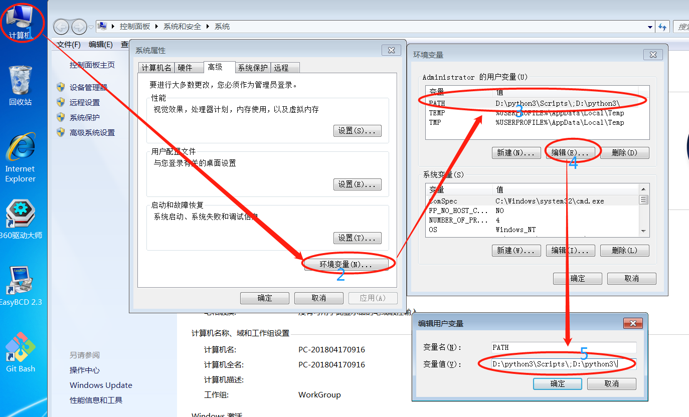
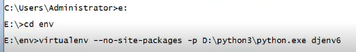
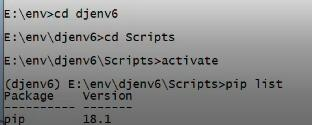
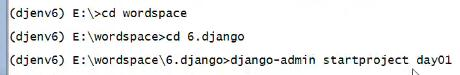
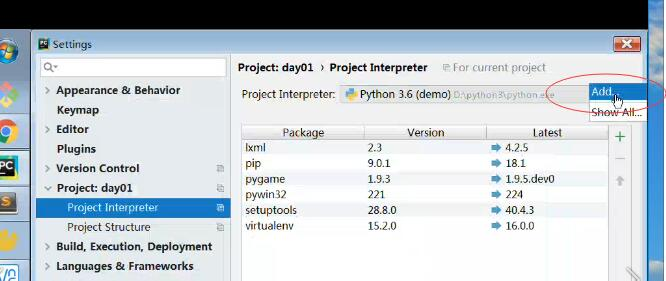
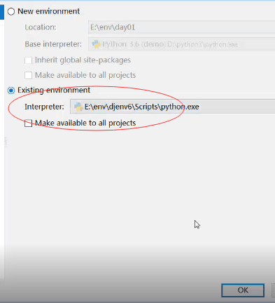
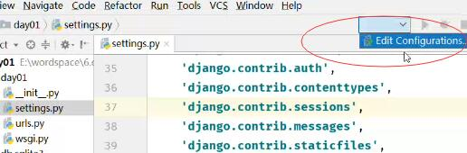
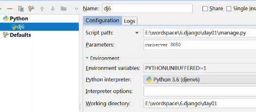
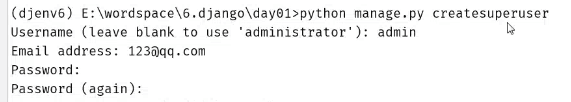

**1.创建环境**

```
纯净的虚拟环境: virtualenv --no-site-packages  name

多个python版本，python2.7 python3.6:

virtualenv --no-site-packages -p D:\xxxx\python3.6.exe name

python版本3.6 + django 1.11

```


**2.创建项目**

```
django-admin startproject 项目名day01	

day01工程目录文件夹，init.py、settings.py、urls.py、wsgi.py

manage.py: 工具集管理入口

```


**3.启动**

```
IP: 0.0.0.0  PORT: 80

python manage.py runserver IP:PORT

python manage.py runserver PORT

```


**4.访问管理后台 admin**

```
http://127.0.0.1:8080/admin/
```

**5.修改数据库配置settings.py**

ENGINE, USER, PASSWORD, HOST, PORT, NAME

**6.映射模型到数据库中**

python manage.py migrate

**7.安装数据库驱动**

pip install pymysql

**8.初始化数据库的驱动init.py**

import pymysql
pymysql.install_as_mysqldb()

**9.创建超级管理员命令**

python manage.py createsuperuser


**MVC**

```
M(模型层)
V(视图层)
C(业务层)
```

**Django ===> MVT**

```
M(模型层)
V(视图): 处理业务逻辑
T(模板Template): html
```


**MVC?**

Model View  Controller，是模型(model)－视图(view)－控制器(controller)的缩写，一种软件设计典范，用一种业务逻辑、数据、界面显示分离的方法组织代码，将业务逻辑聚集到一个部件里面，在改进和个性化定制界面及用户交互的同时，不需要重新编写业务逻辑，通俗的来讲就是，强制性的使应用程序的输入，处理和输出分开。

**优点**：
减低各个模块之间的耦合性，方便变更，更容易重构代码，最大程度的实现了代码的重用


**MVT模式**

Model： 负责业务与数据库(ORM)的对象

View： 负责业务逻辑并适当调用Model和Template

Template: 负责把页面渲染展示给用户

注意： Django中还有一个url分发器，也叫作路由。主要用于将url请求发送给不同的View处理，View在进行相关的业务逻辑处理。


**环境项目搭建步骤:**

1.  环境变量配置方法




2. 执行

   ```
   C:User\Adminstrator>pip install virtualenv

   #装的内容在python3\Lib\site-packages文件夹下
   #python3.6安装后，若在script下无pip可执行文件，输命令
   #python -m ensurepip
   #分别创建env和wordspace文件夹
   ```

3. 执行




```
pip list-查看版本
pip freeze-查看版本
```


4. 激活




5. 创建项目



6.  url配置项目依赖的解释器






terminal出现

	(djenv6) E:\wordspace

7. 配置






8. 修改setting.py

```
DATABASES={
  'default':{
    'ENGINE':'django.db.backends.mysql',
    'NAME':'dj6',
    'USER':'root',
    'PASSWORD':'*****',
    'HOST':'127.0.0.1',
    'PORT':3306
  }
}	
```

9. 新建数据库

   ```
   新建数据库
   名：dj6
   字符串：utf8
   排序规则：utf8_general_ci

   #安装数据库的驱动
   terminal-->pip install pymysql
   #terminal就是在虚拟环境里面的，所以pymysql也是在虚拟环境中的。
   ```

10. 配置 __init__.py

    ```
    import pymysql
    pymysql.install_as_MySQLdb()
    ```

11. 配置admin管理后台



```
terminal-->python manage.py migrate
	数据库中就可以生成表，但是空表，现在想要加入数据
		-->python manage.py createsupruser
		-->admin
		-->123@qq.com
```

