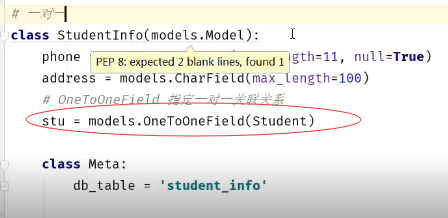
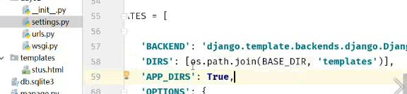
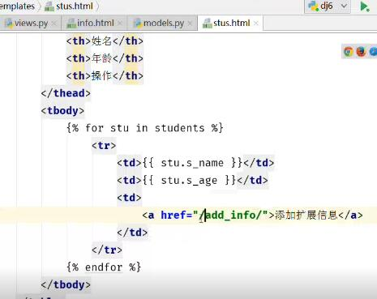
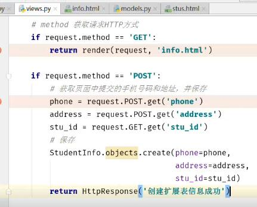

**1.复习昨天**

```
1.模型定义
	AutoField 
	CharField
	IntegerField
	BooleanField
	DateTimeField
	DateField
2.约束
	primary_key
	unique
	default
	auto_now
	auto_now_add 用在记录第一次时间
3.模型的CRUD
	1.创建 
		-模型名称.objects.create(字段)
	2.查询
		-a.查所有 all()
		-b.查询满足条件 模型名.objects.filter().filter()
					 模型名.objects.filter(字段1，字段2)
		-c.获取确定的某一个
			-模型名.objects.get(条件)
			-注意：条件不满足 无法获取数据 则报错
			-满足条件数据多于1个对象，也报错
		-d.排除满足条件的数据
			-模型名.objects.exclude(字段)
		-e.返回结果序列化
			-模型名.objections.values(字段1，字段2)
			-如果括号里面没写，返回的是全部
		-f.排序
			-升序 模型名.objects.order_by(字段1)
			-降序 模型名.objects.order_by(-字段1)
		-h.查询过滤条件
			-字段__contains
			contains,startwith,endwith,gt,gte,lt,lte,
	3.删除
		-模型名.objects.filter(字段1).delete
		
	4.更新
		-模型名.objects.filter(字段1).update(字段1='新值')
	
	5.与或非Q()
		-& ，
		-|
		-~
	6.字段的比较
		from django.db.models import Q,F
		stus=Student.objects.filter(yuwen__gt=F('shuxue')+10
```
**2. 关联关系**

```
		-一对一:OneToOneField
			class A:
				id=xxxx
				b=OneToOneField(B)
			class B:
				id=xxxx
				已知a对象，查找B：a.b
				已知b对象, 查找A: b.a
				
		-一对多:Foreignkey
				class A:
				id=xxxx
				b=Foreignkey(B)
			class B:
				id=xxxx
				已知a对象，查找B：a.b
				已知b对象, 查找A: b.a_set
		
		-多对多
```

3.  一对一定义、模板templates、渲染

   ```
   1.在models定义模型，迁移到数据库
   2.setting.py修改参数
   3.创建url
   	url(r'^all_stu',views.all_stu)
   4.views定义函数
   	-def all_stu(request):
   		stus=Student.objects.all()
   		return render(request,'stus.html',{'student':stus})
   5.stus.html
   	
   		<p>姓名:{{ stu.s_name }}，年龄:{{ stu.s_age }}</p>
   	
   6.渲染访问
   ```

   


   


   


4. 一对一学生拓展信息表信息添加

   ```
   1.settings.py
   	47行注释掉
   2.增加a标签，地址/add_info/,跳转到add_info界面
   3.定义路由
   4.views方法，返回页面info,收集信息
   ```






5. 一对一反向查询

   ```
   class Student(models.Model):
       #定义s_name字段，最长不超过6个字符，唯一
       s_name=models.CharField(max_length=6,unique=True)
       #定义s_age字段，是int类型
       s_age=models.IntegerField(default=18)
       #定义性别，int类型
       s_gender=models.BooleanField(default=1)
       #定义create_time,创建时间
       create_time=models.DateTimeField(auto_now_add=True,null=True)
       #定义operate_time字段，修改时间
       operate_time=models.DateTimeField(auto_now=True,null=True)

       #定义语文成绩字段
       yuwen=models.DecimalField(decimal_places=1,max_digits=4,null=True)
       #定义数学成绩
       shuxue=models.DecimalField(decimal_places=1,max_digits=4,null=True)

       grade=models.ForeignKey(Grade,null=True)
   ```


       class Mate:
           #定义模型迁移到数据库中时的表名
           db_tables='student'

   #一对一
   class StudentInfo(models.Model):
       phone=models.CharField(max_length=11,null=True)
       address=models.CharField(max_length=100)
       #OneToOneField 指定一对一关联关系
       stu = models.OneToOneField(Student)


       class Mate:
           db_table='student_info'

   ```

   ```
   def sel_stu_by_info(request):
       if request.method == 'GET':
           #知道手机号，找人
           info=StudentInfo.objects.get(phone=111)
    
           student=info.stu
           print(student.s_name)
           return HttpResponse('通过手机号码查找学生信息')
    
           #stu.studentinfo studentinfo.stu 两种关联
           #onetoonefield，该字段定义在关联的任意一个模型中均可以
   ```

6. 一对一正向查询

   ```
   def sel_info_by_stu(request):
       if request.method == 'GET':
           #通过具体的学生来查询学生电话
           stu=Student.objects.get(s_name='小李')
    
           #第一种
           info=StudentInfo.objects.filter(stu_id=stu.id)
           info=StudentInfo.objects.filter(stu=stu)
    
           #第二种,学生对象，关联的模型名的小写拿到拓展信息
           info=stu.studentinfo
    
           return HttpResponse('通过学生查找拓展表信息')

   ```

7. 一对多的正向和反向查询

   ```
1.增加数学和语文两门科目及成绩
2.定义url
3.写views方法
4.执行后，可在表格查看
5.给所有的学生手动增加学院
```

```
class Grade(models.Model):
    g_name=models.CharField(max_length=10,unique=True)

    class Mate:
        db_table='grade'


def add_grade(request):
    if request.method == 'GET':
        names=['物联网','计科','外语']
        for name in names:
            Grade.objects.create(g_name=name)
        return HttpResponse('创建班级成功')


def sel_stu_grade(request):
    if request.method == 'GET':
        #1.学生找班级
        stu=Student.objects.filter(s_name='小李').first()
        grade=stu.grade
    
        #2.班级找学生
        grade=Grade.objects.filter(g_name='外语')
        students=grade.student.set
        return HttpResponse('查询学生和班级信息')
8. 多对多

   class Course(models.Model):
       #定义多对多
       c_name=models.CharField(max_length=8)
       #定义关联字段
       stu= models.ManyToManyField(Student)
    
       class Mate:
           db_table='course'
   ```

   ```
   def add_course(request):
       #添加课程
       names=['大学语文','日语','视频鉴赏','线性代数']
       for name in names:
           Course.objects.create(c_name=name)
       return HttpResponse('创建课程成功')

   def add_stu_course(request):
       if request.method== 'GET':
           cous=Course.objects.all()
           return render(request,'course.html',{'cous':cous})
    
       if request.method== 'POST':
           c_id=request.POST.get('cous_id')
           s_id=request.GET.get('stu_id')
    
           stu=Student.objects.get(pk=s_id)
           #设置学生课程关联关系
           course=Course.objects.get(pk=c_id)
           stu.course_set.add(course)
           #跳转的无限重定项302,定向到某一个地址上去
           return HttpResponseRedirect('/all_stu/')

