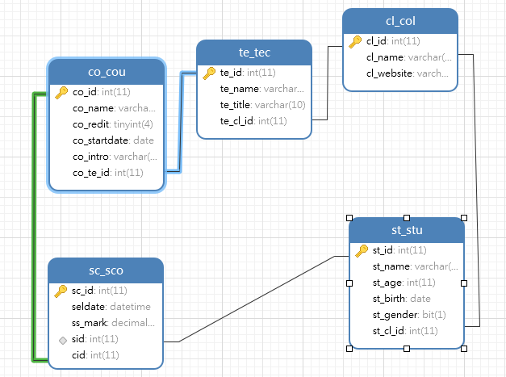

[TOC]

##### 1.语言

-- SQL (Structured Query Language)
-- DDL:数据定义语言create/drop/alter
-- DML:数据操作语言insert/delete/update/select
-- DCL:数据控制语言grant/revoke


##### 2.数据库

```
-- 删除数据库
drop database if exists school;

-- 创建数据库
-- 建库和建表都是create
create database school default charset utf8;
create database maoyan_db default character set 'utf8';
create database school default charset utf8 collate utf8_bin;

-- 切换到school数据库
use school;
```

##### 3.简单表格

```
-- 创建表
create table maoyan(
    id int auto_increment primary key,
    image varchar(1024)
);

create table tb_student(
name int not null,
addr varchar(6) not null,
gender bit not null default 1,
birth date,
primary key (name)
);

-- 删除表
drop table if exists tb_student;

-- 修改表
alter table tb_student add column tel varchar(11) not null;
alter table tb_student drop column tel; 
```

##### 3.复杂表格

```
create database sh default charset utf8;

use sh;

create table st_stu(
st_id int auto_increment,
st_name varchar(4) not null,
st_age int not null,
st_birth date,
st_gender bit not null default 1,
primary key (st_id)
);

create table sc_sco(
sc_id int not null auto_increment,
seldate datetime default now(),
ss_mark decimal(4,1),
primary key(sc_id)
);

create table co_cou(
co_id int not null,
co_name varchar(20) not null,
co_redit tinyint not null,
co_startdate date not null,
co_intro varchar(200),
primary key(co_id)
);

create table cl_col(
cl_id int not null,
cl_name varchar(50) not null,
cl_website varchar(1024),
primary key(cl_id)
);

create table te_tec(
te_id int not null auto_increment,
te_name varchar(4) not null,
te_title varchar(10) not null,
primary key(te_id)
);

多对一单纯外键
-- 删除外键
alert table co_cou drop foreign key fk_co_te_id;

-- 课程添加键
alter table co_cou add column co_te_id int; 
-- 关联教师
alter table co_cou add constraint fk_co_te_id foreign key(co_te_id) references te_tec(te_id);


-- 教师添加键
alter table te_tec add column te_cl_id int;
-- 关联学院
alter table te_tec add constraint fk_te_cl_id foreign key(te_cl_id) references cl_col(cl_id);

-- 学生加外键
alter table st_stu add column st_cl_id int;
-- 关联学院
alter table st_stu add constraint fk_st_cl_id foreign key(st_cl_id) references cl_col(cl_id);

-- 多对多
-- 创建学生和课程中间表（关系型数据库无法用两张表来表示两个实体的多对多关系）
-- 中间表就是成绩表

alter table sc_sco add column sid int;
alter table sc_sco add column cid int;

alter table sc_sco add constraint fk_sc_st_id foreign key(sid) references st_stu(st_id);
alter table sc_sco add constraint fk_sc_co_id foreign key(cid) references co_cou(co_id);
```




##### 4.数据修改

```
-- 插入数据
insert into tb_student values 
(1001,'罗浩',1,'四川成都',13112341234);

insert into tb_student (id, name,tel) values 
(1003,'白元芳',13112346789);

insert into tb_student (id,name,tel) values 
(1004,'狄仁杰',12345678911),
(1005,'黄飞鸿',12345678911),
(1006,'李大嘴',12345678911);

#将来不会删除全表，绝大多数删除不是真正删除，如果真删全表，truncate table tb_student ,截断数据

-- 删除数据
delete from tb_student where id in (1006,1004);
delete from tb_student where name='黄飞鸿';

-- 更新数据
update tb_student set addr='四川绵阳',gender=0 where id in (1002,1003);
```


##### 其他知识

```
1.非空约束 not null
2.默认约束 default
3.主键 primary key
4.性别 gender bit not null default 1
5.时间 date
```


##### 其他操作

```
-- 添加唯一约束
alter table cl_col add constraint unique_website unique(cl_website);

-- 增加索引
create index ix_maoyan_actor on maoyan(actor);

-- 删除索引
alter table cl_col drop index unique_website;

```

