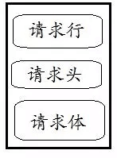
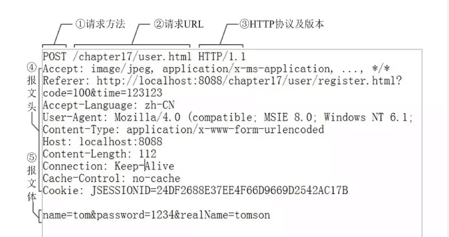

[TOC]

	TODO-List(时间：一周):
	    域名申请(思考喜欢的域名，申请马上就有)
	    icp备案(2周内下来)
	    linux安装-将自己的电脑换成linux
	    lantern蓝灯
	    json读取，页面


##### 1.爬虫

a.网络爬虫（web crawler），以前经常称之为网络蜘蛛（spider）。

b.是按照一定的规则自动浏览万维网并获取信息的机器人程序（或脚本），曾经被广泛的应用于互联网搜索引擎。

##### 2.爬虫领域

a.在理想的状态下，所有ICP（Internet Content Provider）都应该为自己的网站提供API接口来共享它们允许其他程序获取的数据，在这种情况下爬虫就不是必需品，国内比较有名的电商平台（如淘宝、京东等）、社交平台（如腾讯微博等）等网站都提供了自己的Open API，但是这类Open API通常会对可以抓取的数据以及抓取数据的频率进行限制。

b.大多数企业数据信息匮乏，相关领域：

1.搜索引擎
2.新闻聚合
3.社交应用
4.舆情监控
5.行业数据

##### 3.爬虫合法性探讨

1.网络爬虫领域目前还属于拓荒阶段，虽然互联网世界已经通过自己的游戏规则建立起一定的道德规范(Robots协议，全称是“网络爬虫排除标准”)，但法律部分还在建立和完善中，也就是说，现在这个领域暂时还是灰色地带。

2.“法不禁止即为许可”，如果爬虫就像浏览器一样获取的是前端显示的数据（网页上的公开信息）而不是网站后台的私密敏感信息，就不太担心法律法规的约束，因为目前大数据产业链的发展速度远远超过了法律的完善程度。

3.在爬取网站的时候，需要限制自己的爬虫遵守Robots协议，同时控制网络爬虫程序的抓取数据的速度。


```
Robots.txt文件

大多数网站都会定义robots.txt文件，下面以淘宝的robots.txt文件为例，看看该网站对爬虫有哪些限制。

User-agent: Baiduspider
Allow: /article
Allow: /oshtml
Disallow: /product/
Disallow: /

User-Agent: Googlebot
Allow: /article
Allow: /oshtml
Allow: /product
Allow: /spu
Allow: /dianpu
Allow: /oversea
Allow: /list
Disallow: /

User-agent: Bingbot
Allow: /article
Allow: /oshtml
Allow: /product
Allow: /spu
Allow: /dianpu
Allow: /oversea
Allow: /list
Disallow: /

User-Agent: *
Disallow: /

	注意：上面robots.txt第一段的最后一行，通过设置“Disallow: /”禁止百度爬虫访问除了“Allow”规定页面外的其他所有页面。因此当你在百度搜索“淘宝”的时候，搜索结果下方会出现：“由于该网站的robots.txt文件存在限制指令（限制搜索引擎抓取），系统无法提供该页面的内容描述”。百度作为一个搜索引擎，至少在表面上遵守了淘宝网的robots.txt协议，所以用户不能从百度上搜索到淘宝内部的产品信息。
```

##### 4.http

URL(Uniform Resource Locator)统一资源定位符
URI(Uniform Resource Identifier)统一资源标定符

a.URL是URI的子集
b.URI还包括一个子类URN统一资源名称，URN只命名，不指定

企业想用爬虫干什么？
你想用爬虫干什么？

```
Http协议

a.HTTP中文名叫超文本传输协议，因为我们在网页上看到的内容通常是浏览器执行HTML语言得到的结果，而HTTP就是传输HTML数据的协议。HTTP和其他很多应用级协议一样是构建在TCP（传输控制协议）之上的，它利用了TCP提供的可靠的传输服务实现了Web应用中的数据交换。按照维基百科上的介绍，设计HTTP最初的目的是为了提供一种发布和接收HTML页面的方法，也就是说这个协议是浏览器和Web服务器之间传输的数据的载体。

Https协议

HTTPS是以安全为目标的HTTP通道，简单讲是HTTP的安全版，即HTTP下加入SSL层。HTTPS的安全基础是SSL，因此通过它传输的内容都是经过SSL加密的，它的主要作用可以分为两种。
```

面试：回答区别？

1. https
2. 证书，确认网站的真实性
3. SSL传输内容加密


面试：get请求和post请求区别？
​	get请求的参数直接在url里面，最多1024字节
​	post请求数据一般通过表单提交，不会出现在url里面，大小没有限制

```
get 请求指定信息
head 获取接头
post 向指定资源提交数据处理要求(例如提交表单或者上传文件)，数据包含在请求体中，post可能导致新的资源的建立和原来资源的修改
put 从客户端向服务端传送的数据取代指定的内容
delete 请求服务器删除指定页面
connect 预留给能够将连接改为管理方式的代理服务器
options 允许客户端查看服务器功能
trace 回显服务器收到的请求，用户测试或诊断
```

##### 5.请求头

```
请求头

cache-control，指定服务器和客户端在交互时遵循的缓存机制

请求头，用来说明服务器要使用的附加信息，比较重要的信息有Cookie、Referer、User-Agent等。

```

下面说一下一些常用的头信息：
**Accept**：请求报头域，用于指定客户端可以接收哪些类型的信息。
**Accept-Language**：指定客户端可以接受的语言类型。
**Accept-Encoding**：指定客户端可以接受的内容编码。
**Host**：用于指定请求资源的主机IP和端口号，器内容为请求URL的原始服务器或者网关的位置。从HTTP1.1banbenkaishi，请求必须包含此内容。
**Cookie**：也常用复数形式Cookies，这是网站为了辨别用户进行会话跟踪而存储在本地的用户本地数据。它的主要功能是维持当前访问会话。Cookies里面有信息标示了我们所对应的服务器的会话，每次浏览器在在请求该站点的页面时，都会在请求头上加上Cookies并将其发送给服务器，服务器通过Cookies识别出是我们自己，并且查出当前状态是登录状态，所以返回结果就是登陆之后才能看到的网页内容。
**Referer**：用来标识这个请求是从那个网页发过来的，服务器可以拿到这一信息并做相应的处理，如做来源统计、防盗链处理等。
**User-Agent**：简称UA，它是一种特殊的字符串头，可以使服务器识别客户使用的操作系统以及版本、浏览器及版本等信息。在做爬虫时加上此信息，可以伪装为浏览器；如果不加，很有可能被识别出是爬虫。
-**User-Type**： 也叫互联网媒体类型或者MIME类型，在HTTP协议的消息头中，它用来表示具体请求中的媒体类型信息。例如，text/html表示HTML格式，image/gif代表GIF图片，application/json代表JSON类型，更多对应关系可以查看此对照表http://tool.oschina.net/commons
因此，请求头是请求的总要组成部分，在写爬虫时，大部分情况下都需要设定请求头。


##### 6.请求体

POST请求体有内容，GET请求，请求体为空
设置Request Header Content-Type
application/x-www-form-urlencoded 表单数据
multipart/form-data 表单⽂件上传
application/json 序列化json数据
text/xml xml数据


##### 7.请求行

```
请求行 = 请求方法+请求URL+HTTP协议及其版本

请求方式

常见的请求方法有两种POST和GET。

GET和POST请求方法有如下区别:

- GET请求中的参数包含在URL里面，数据可以在URL中看到，而POST请求的URL不会包含这些数据，数据都是通过表单形式传输的，包含在请求体中，所以POST请求比GET请求个安全。
- GET请求提交的数据最多只有1024字节，而POST请求没有限制。一般情况下，GET请求用于查询，POST请求用于增、删、改。

请求URL

请求的网址，即统一资源定位符URL，可以唯一确认我们想请求的资源

```

##### 8.响应

```
响应，由服务端返回给客服端，可以分为三个部分：响应状态吗、响应头，响应体

响应状态码

响应状态码表示响应的响应状态，如200表示服务器正常响应，404代表页面没有找到，500代表服务器内部发生错误，在爬虫中，我们可以根据状态码来判断服务器响应状态，如果状态码为200，则证明成功返回数据，再进行进一步的处理，否则直接忽略。响应码对照表http://tool.oschina.net/commons?type=5

响应头

响应头包含了服务器对请求的应答信息，如Content-Type、Server 、Server-Cookei等。

```

下面简要说明一下一些常用的头信息：
**Date**：标识响应产生的时间。
**Last-Modified**：指定资源的最后修改时间。
**Content-Encoding**：指定响应内容的编码。
**Server**：包含服务器的信息，比如：名称、版本号等。
**Content-Type**：文档类型，指定返回的数据类型是什么，text/html表示HTML格式，image/gif代表GIF图片，application/json代表JSON类型，更多对应关系可以查看此对照表http://tool.oschina.net/commons
**Set-Cookie**：设置Cookies。响应头中的Set-Cookie告诉浏览器需要j将次内容放在cookies中，下次请求携带cookies请求。
**Expires**：指定响应的过期时间，可以使用代理服务器或者浏览器将加载的内容更新到缓存中。如果再次访问时，可以直接从缓存中加载，降低服务器负载，缩短响应时间。

##### 9.请求图片

```
HTTP请求

HTTP请求（请求行+请求头+[请求体]）：
```





##### 

