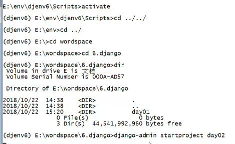
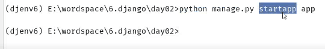
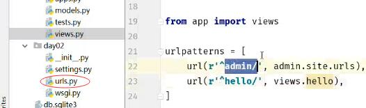
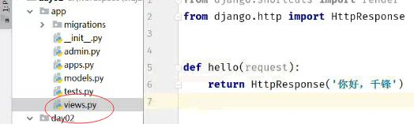
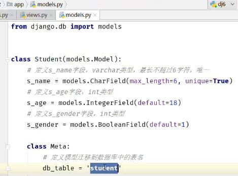
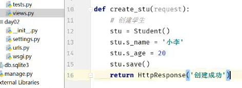
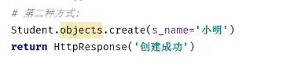
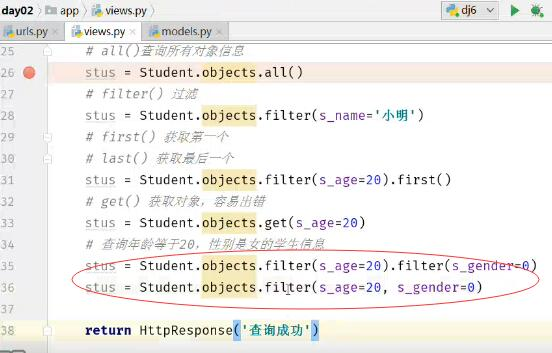

1. 项目搭建、数据库配置、简单视图返回

   ```
   1.先激活环境，创建day02
   2.指定虚拟环境
   3.启动脚本文件
   4.修改DATABASE
   5.init中引入pymysql
   ```



```
创建应用app
```



```
定义路由url
```




```
设置方法，返回响应
在浏览器里面可以访问地址，看效果
```




2. 模型定义、数据迁移

   ```
   orm对象关系映射，调用对应的方法，调用原生的mysql查询语句
   -->settings
         INSTALLED_APPS=[
         'app',
         ]
   ```




```
python manage.py makemigrations
#生成迁移文件
python manage.py migrate
#将文件迁移到数据库 
```


3. 创建数据

   ```
   1.url定义路由
   2.views定义字段，赋值
   ```

   ```
   url(r'^create_stu/',views.create_stu)
   ```








4. 数据库模型查询


```
1.先定义路由url
2.定义方法views,实现查询
all()
filter()
get()
first()
last()
```




5. 多种查询

```
exclude()
order_by()
contains
startwith()
endwith()
```

```
from  django.http import HttpResponse
from  django.http import render
from  app.models  import Student

def hello(request):
	return HttpResponse('你好,千锋')

def create_stu(request):
	#第一种方式：
	stu=Student()
	stu.s_name='小李'
	stu.s_age=20
	stu.save()
	
	#第二种方式：
	Student.object.create(s_name='小明')
	Student.object.create(s_name='小花')
	Student.objects.create(s_name='梨哥')
    Student.objects.create(s_name='大锤')
    Student.objects.create(s_name='小锤')
    Student.objects.create(s_name='温婉')
    Student.objects.create(s_name='张三')
    
    return HttpResponse('创建成功！')
    
 
def sel_stu(request):
	#1.查所有all()
	stus=Student.object.all()
	
	#2.过滤filter()
	stus=Student.object.filter(s_name='小明')
	
	#3.first()获取第一个
	stus=Student.objects.filter(s_age=20).first()
	stus=Student.objects.get(s_age=20)
	
	#4.查询年龄20，性别女
	stus=Student.objects.filter(s_age=20)
	.filter(s_gender=0)
    stus=Student.objects.filter(s_age=20,s_gender=0)
    
    #5.模糊查询
	stus=Student.objects.filter(s_name__contains='锤')
    stus=Student.objects.filter(s_name__startswith='小')
    
    #6.大于gt 大于等于gte greater than 小于lt litter than 
    stus=Student.objects.filter(s_age__gte=18)
    
    #7.升序
    stus=Student.objects.order_by('id')
    
    #8.降序
    stus=Student.objects.order_by('-id')
    
    #9.查询不满足条件的数据
    stus=Student.objects.exclude(s_age=18)
    
    #10.统计个数
    stus_count=stus.count()
    print(stus_count)
    
    #11.id和pk
    stus=Student.objects.filter(id=2)
    stus=Student.objects.filter(pk=2)
    
    #12.查值values
    stus=stus.values()
    
    stu_names = [stu.s_name for stu in stus]
    print(stu_names)
    
    return HttpResponse('查询成功！')
```