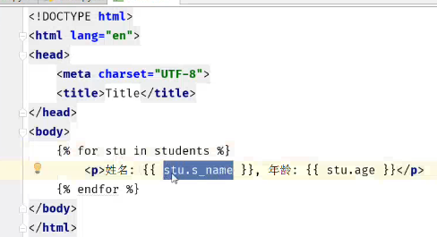
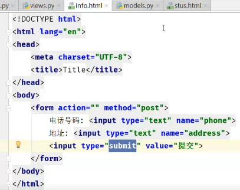

**1.复习昨天**

```
1.模型定义
	AutoField 
	CharField
	IntegerField
	BooleanField
	DateTimeField
	DateField
2.约束
	primary_key
	unique
	default
	auto_now
	auto_now_add 用在记录第一次时间
3.模型的CRUD
	1.创建 
		-模型名称.objects.create(字段)
	2.查询
		-a.查所有 all()
		-b.查询满足条件 模型名.objects.filter().filter()
					 模型名.objects.filter(字段1，字段2)
		-c.获取确定的某一个
			-模型名.objects.get(条件)
			-注意：条件不满足 无法获取数据 则报错
			-满足条件数据多于1个对象，也报错
		-d.排除满足条件的数据
			-模型名.objects.exclude(字段)
		-e.返回结果序列化
			-模型名.objections.values(字段1，字段2)
			-如果括号里面没写，返回的是全部
		-f.排序
			-升序 模型名.objects.order_by(字段1)
			-降序 模型名.objects.order_by(-字段1)
		-h.查询过滤条件
			-字段__contains
			contains,startwith,endwith,gt,gte,lt,lte,
	3.删除
		-模型名.objects.filter(字段1).delete
		
	4.更新
		-模型名.objects.filter(字段1).update(字段1='新值')
	
	5.与或非Q()
		-& ，
		-|
		-~
	6.字段的比较
		from django.db.models import Q,F
		stus=Student.objects.filter(yuwen__gt=F('shuxue')+10
```
**2. 关联关系**

```
		-一对一:OneToOneField
			class A:
				id=xxxx
				b=OneToOneField(B)
			class B:
				id=xxxx
				已知a对象，查找B：a.b
				已知b对象, 查找A: b.a
				
		-一对多:Foreignkey
				class A:
				id=xxxx
				b=Foreignkey(B)
			class B:
				id=xxxx
				已知a对象，查找B：a.b
				已知b对象, 查找A: b.a_set
		
		-多对多
```

3.  一对一定义、模板templates、渲染

   ```
   1.在models定义模型，迁移到数据库
   2.setting.py修改参数
   3.创建url
   	url(r'^all_stu',views.all_stu)
   4.views定义函数
   	-def all_stu(request):
   		stus=Student.objects.all()
   		return render(request,'stus.html',{'student':stus})
   5.stus.html
   	
   		<p>姓名:{{ stu.s_name }}，年龄:{{ stu.s_age }}</p>
   	
   6.渲染访问
   ```

   


   


   


4. 一对一学生拓展信息表信息添加

   ```
   1.settings.py
   	47行注释掉
   2.增加a标签，地址/add_info/,跳转到add_info界面
   3.定义路由
   4.views方法，返回页面info,收集信息
   ```




5. 一对一反向查询

   ```

   ```