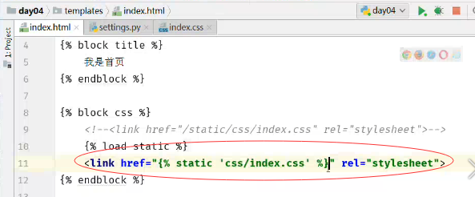
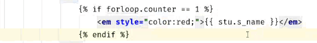
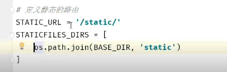

1. 注解、模板继承

   ```
   {#子类对父类方法的继承,引入父模板的block js中定义的内容#}
       {# 单行注释 #}
       
       
           多行注释
       

       {{ block.super }}
       
       {# forloop.revcounter倒序 #}
       {# forloop.counter顺序 #}
       {# forloop.first 循环第一次打印ture #}
   ```

**base.html**

```
<!DOCTYPE html>
<html lang="en">
<head>
    <meta charset="UTF-8">
    <title>
        
        
    </title>
    
    
    
    
    
</head>
<body>
    
    
</body>
</html>
```

**base_main.html**

```


     <script src="https://code.jquery.com/jquery-3.1.1.min.js"></script>

```

**index.html**

```


    我是首页



        {#加载静态文件的两种方式#}
	{#<link href="/static/css/index.css" rel="stylesheet">#}
    
    <link href="" rel="stylesheet">



    <p>千锋</p>

```

**stus.html**

```



<table>
        <thead>
        <th>序号</th>
        <th>id</th>
        <th>姓名</th>
        <th>年龄</th>
        <th>创建时间</th>

        </thead>
        <tbody>
            {# 过滤器共有40多个 #}
            {{ content_h2 | safe }}
            
                 <tr>
                     <td>{{ forloop.counter }}</td>
                     <td>{{ stu.id }}</td>
                     <td>
						{##}
						
                         
                             <strong style="color: red">{{ 										stu.s_name }}</strong>
                         
                             {{ stu.s_name }}
                         
                     </td>
                     <td>{{ stu.s_age | add:1 }}</td>
                     <td>{{ stu.create_time | date:'Y-m-d H:m:s'}}						</td>
                 </tr>
            
        </tbody>
    </table>

```

2. 静态css两种加载方式

   ```
   1.设置link标签
   2.设置setting参数
   3.定义路由
   4.设置html 
   5.views
   def index(request):
       if request.method== 'GET':
           return render(request,'index.html')
   另一种方式就是直接对标签进行设置属性
   ```








**3.过滤器**

   引入过滤器定义：{{var|过滤器}}， 作用：在变量显示前修改 过滤器有很多，比如add / lower / upper

   ##### 3.1 加法

   ```
       {{ p.page | add:5 }}
       没有减法的过滤器，但是加法里面可以加负数
       {{ p.page | add: -5 }}

   ```

   ##### 3.2 修改大小写

   ```
       lower / upper : {{ p.pname | lower }} 变为小写或者大写

   ```

   ##### 3.3 传参数

   过滤器可以传递参数，参数需要使用引号引起来。比如join： {{ student | join ‘=’ }} 如果值为空则设置默认值：

   ```
       默认值：default，格式{{ var | default value }}
       如果变量没有被提供或者为False，空，会使用默认值

   ```

   ##### 3.4 定制日期格式

   根据制定格式转换日期为字符串，处理时间的就是针对date进行的转换
   {{ dateVal | date: ‘y-m-d hⓂ️s’ }}
   如果过滤器，定义为小写的y，则返回的数据为两位的年。如果写的是大写的Y，则返回的是四位的年
   定义小写的m，则返回数字的月份，如果定义大写的M，则返回英文
   定义小写的h，则返回12小时制度的时，如果定义的是大写的H，则返回24小时制度的时

   ##### 3.5 是否转义

   HTML转义: 将接收到的数据当成普通字符串处理还是当成HTML代码来渲染的一个问题 渲染成html： {{ code | safe }} 还可以使用autoscape渲染: {{ autoscape off }} {{ endautoscape }} 不渲染的话: {{ autoscape on }} {{ endautoscape }}

   ##### 3.6 案例

   ```
   <!--1. 字符串‘Python’转化为大写,输出结果为：PYTHON-->
   {{ 'Python'|upper }}
   <!--2. 字符串‘PYTHON’转化为小写,输出结果为：python-->
   {{ 'PYTHON'|lower }}
   <!--3. 变量3增加4,输出结果为：7-->
   {{ 3|add:'4' }}
   <!--4. 第一个字符转化成大写形式,输出结果为：Python-->
   {{ 'python'|capfirst }}
   <!--5. 删除指定符号的值,输出结果为：studypythonisveryhappy -->
   {{ 'study python is very happy'|cut:' ' }}
   <!--6. 输出缺省值,输出结果为：nothing-->
   {{ ''|default:'nothing' }}
   <!--7. 返回第一个元素,输出结果为：p-->
   {{ 'python'|first }}
   <!--8. 返回最后一个元素,输出结果为：n-->
   {{ 'python'|last }}
   <!--9. 计算长度,输出结果为：6-->
   {{ 'python'|length }}
   <!--10. 随机一个元素,输出随机结果为：y-->
   {{ 'python'|random }}

   ```

   ##### 3.7 django内建过滤器大全

   ```
   1、add ：将value的值增加2。使用形式为：{{ value | add: "2"}}。
   2、addslashes：在value中的引号前增加反斜线。使用形式为：{{ value | addslashes }}。
   3、capfirst：value的第一个字符转化成大写形式。使用形式为：{{ value | capfirst }}。
   4、cut：从给定value中删除所有arg的值。使用形式为：{{ value | cut:arg}}。
   5、date: 格式化时间格式。使用形式为：{{ value | date:"Y-m-d H:M:S" }}
   6、default：如果value是False，那么输出使用缺省值。使用形式：{{ value | default: "nothing" }}。例如，如果value是“”，那么输出将是nothing
   7、default_if_none：如果value是None，那么输出将使用缺省值。使用形式：{{ value | default_if_none:"nothing" }}，例如，如果value是None，那么输出将是nothing
   8、dictsort：如果value的值是一个字典，那么返回值是按照关键字排序的结果
   使用形式：{{ value | dictsort:"name"}}，例如，
   如果value是：
   [{'name': 'python'},{'name': 'java'},{'name': 'c++'},]
   那么，输出是：
   [{'name': 'c++'},{'name': 'java'},{'name': 'python'}, ]
   9、dictsortreversed：如果value的值是一个字典，那么返回值是按照关键字排序的结果的反序。使用形式：与dictsort过滤器相同。
   10、divisibleby：如果value能够被arg整除，那么返回值将是True。使用形式：{{ value | divisibleby:arg}}，如果value是9，arg是3，那么输出将是True
   11、escape：替换value中的某些字符，以适应HTML格式。使用形式：{{ value | escape}}。例如，< 转化为 &lt;> 转化为 &gt;' 转化为  &#39;" 转化为  &quot;
   13、filesizeformat：格式化value，使其成为易读的文件大小。使用形式：{{ value | filesizeformat }}。例如：13KB，4.1MB等。
   14、first：返回列表/字符串中的第一个元素。使用形式：{{ value | first }}
   16、iriencode：如果value中有非ASCII字符，那么将其进行转化成URL中适合的编码，如果value已经进行过URLENCODE，改操作就不会再起作用。使用形式：{{value | iriencode}}
   17、join：使用指定的字符串连接一个list，作用如同python的str.join(list)。使用形式：{{ value | join:"arg"}}，如果value是['a','b','c']，arg是'//'那么输出是a//b//c
   18、last：返回列表/字符串中的最后一个元素。使用形式：{{ value | last }}
   19、length：返回value的长度。使用形式：{{ value | length }}
   20、length_is：如果value的长度等于arg的时候返回True。使用形式：{{ value | length_is:"arg"}}。例如：如果value是['a','b','c']，arg是3，那么返回True
   21、linebreaks：value中的"\n"将被<br/>替代，并且整个value使用</p>包围起来。使用形式：{{value|linebreaks}}
   22、linebreaksbr：value中的"\n"将被<br/>替代。使用形式：{{value |linebreaksbr}}
   23、linenumbers：显示的文本，带有行数。使用形式：{{value | linenumbers}}
   24、ljust：在一个给定宽度的字段中，左对齐显示value。使用形式：{{value | ljust}}
   25、center：在一个给定宽度的字段中，中心对齐显示value。使用形式：{{value | center}}
   26、rjust：：在一个给定宽度的字段中，右对齐显示value。使用形式：{{value | rjust}}
   27、lower：将一个字符串转换成小写形式。使用形式：{{value | lower}}
   30、random：从给定的list中返回一个任意的Item。使用形式：{{value | random}}
   31、removetags：删除value中tag1,tag2....的标签。使用形式：{{value | removetags:"tag1 tag2 tag3..."}}
   32、safe：当系统设置autoescaping打开的时候，该过滤器使得输出不进行escape转换。使用形式：{{value | safe}}
   33、safeseq：与safe基本相同，但有一点不同的就是：safe是针对字符串，而safeseq是针对多个字符串组成的sequence
   34、slice：与python语法中的slice相同。使用形式：{{some_list | slice:"2"}}
   37、striptags：删除value中的所有HTML标签.使用形式：{{value | striptags}}
   38、time：格式化时间输出。使用形式：{{value | time:"H:i"}}或者{{value | time}}
   39、title：转换一个字符串成为title格式。
   40、truncatewords：将value切成truncatewords指定的单词数目。使用形式：{{value | truncatewords:2}}。例如，如果value是Joel is a slug 那么输出将是：Joel is ...
   42、upper：转换一个字符串为大写形式
   43、urlencode：将一个字符串进行URLEncode
   46、wordcount：返回字符串中单词的数目
   ```
