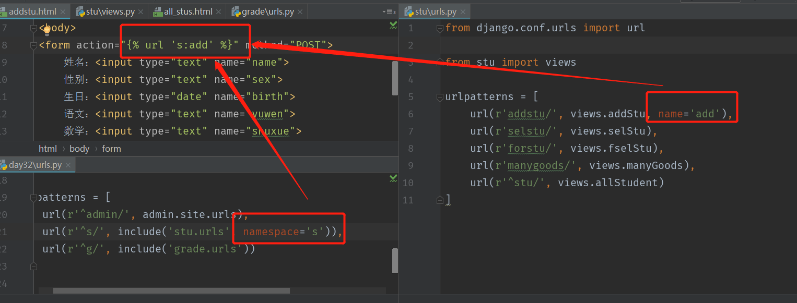

1.反向解析



2. 跨站请求CSRF(cross site request forgery)

```
攻击说明
   1.用户C打开浏览器，访问受信任网站A，输入用户名和密码请求登录网站A;
   2.在用户信息通过验证后，网站A产生Cookie信息并返回给浏览器，此时用户登录网站A成功，可以正常发送请求到网站A;
   3.用户未退出网站A之前，在同一浏览器中，打开一个TAB页访问网站B;
   4.网站B接收到用户请求后，返回一些攻击性代码，并发出一个请求要求访问第三方站点A;
   5.浏览器在接收到这些攻击性代码后，根据网站B的请求，在用户不知情的情况下携带Cookie信息，向网站A发出请求。
   
csrf的攻击之所以会成功是因为服务器端身份验证机制可以通过Cookie保证一个请求是来自于某个用户的浏览器，但无法保证该请求是用户允许的。因此，预防csrf攻击简单可行的方法就是在客户端网页上添加随机数，在服务器端进行随机数验证，以确保该请求是用户允许的。Django也是通过这个方法来防御csrf攻击的。
```
```
Django中配置：
在表单中添加 
在settings中的中间件MIDDLEWARE中配置打开 ‘django.middleware.csrf.CsrfViewMiddleware’
```