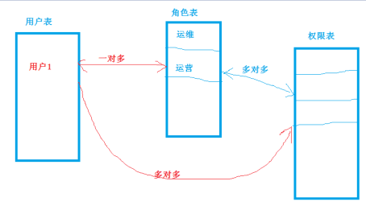
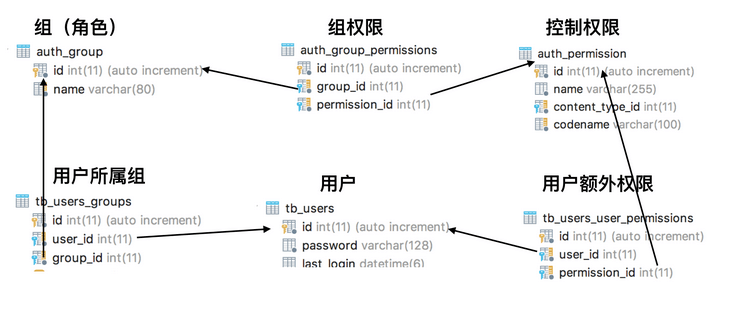
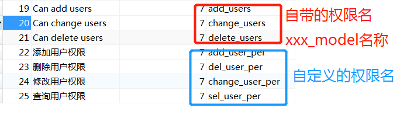

**1.权限**

RBAC（Role-Based Access Control，基于角色的访问控制）就是用户通过角色与权限进行关联。简单地说，一个用户拥有若干角色，每一个角色拥有若干权限。这样，就构造成“用户-角色-权限”的授权模型。在这种模型中，用户与角色之间，角色与权限之间，一般者是多对多的关系。

**简单的权限**：如下就是一个简单的权限设计模式，其中包含了用户表，角色表，权限表。



**复杂权限：**可能设计到用户表、权限表、角色表、用户组表、额外的权限表，在django中提供了这一些列的权限相关模型，关于权限设计中表的关联关系如下：




**权限项：**Django用permission对象存储权限项，每个model默认都有三个permission，即add model, change model和delete model。例如，定义一个名为学生Student模型，当迁移表后，会在auth_permission中自动创建相应的三个permission：add_student, change_student和delete_student。Django还允许自定义permission。


**2. 自定义**

```
from django.db import models
from django.contrib.auth.models import AbstractUser

class MyUser(AbstractUser):
    # 扩展django自带的auth_user表，可以自定义新增的字段

    class Mate:
        # django默认给每个模型初始化三个权限
        # 默认的是change,delete,add权限
        permissions=(
            ('add_my_user','新增用户权限'),
            ('change_my_user_username','修改用户权限'),
            ('change_my_user_password','修改用户密码权限'),
            ('all_my_user','查看用户权限')
        )
```

settting.py 添加设置

```
AUTH_USER_MODEL = 'user.MyUser'
```




**3.1添加用户权限**

```
from django.contrib.auth.models import Permission
from django.http import HttpResponse
from django.shortcuts import render
from user.models import MyUser

def add_user_permission(request):

    if request.method == 'GET':
        # 1.创建用户
        user=MyUser.objects.create_user(username='coco',
                                        password='123456')
        # 2.指定刚创建的用户，并且分配给它权限，新增用户权限，查看用户权限
        permissions=Permission.objects.filter(codename__in=
                                              ['add_my_user','all_my_user']).all()

        for permission in permissions:
            user.user_permissions.add(permission)

        # 3.删除刚创建的用户的新增用户权限
        # user.user_permissions.remove(权限对象)

        return HttpResponse('创建用户权限成功')
```

**装饰器**

```
@check_permissions
def index(request):
    if request.method == 'GET':

        # coco用户如果有查看列表权限
        # 访问之前进行拦截，是装饰器或者中间件

        return render(request,'index.html')

```

```
# 1.外层函数内嵌内层函数
# 2.外层函数返回内层函数
# 3.内层函数调用外层函数的参数
from django.http import HttpResponse
from user.models import MyUser

def check_permissions(func):
    def check(request):
        # coco用户如果有查看列表权限
        user=MyUser.objects.filter(username='coco').first()
        u_p=user.user_permissions.filter(codename='all_my_user').first()
        if u_p:
            return func(request)
        else:
            return HttpResponse('用户没有查看列表权限')
    return check
```

**3.2 添加组权限**

```
def add_group_permission(request):
    if request.method == 'GET':
        # 创建超级管理员（所有），创建普通管理员（修改和查看）
        group = Group.objects.create(name='审核组')
        ps = Permission.objects.filter(codename__in=[
            'change_my_user_username',
            'change_my_user_password',
            'all_my_user',
        ])

        # 给组添加权限
        for permission in ps:
            group.permissions.add(permission)
        return HttpResponse('创建组权限成功')
```

**3.3 用户分配到组**

```
def add_user_group(request):
    if request.method == 'GET':

        # 给用户coco分配审查组
        user=MyUser.objects.filter(username='coco').first()
        group=Group.objects.filter(name='审核组').first()
        # 分配组
        user.groups.add(group)

        return HttpResponse('用户分配组成功')

```

**3.4 展示用户权限**

```
def show_user_permission(request):
    if request.method == 'GET':
        user=MyUser.objects.get(username='coco')

        return render(request,'show_user_permission.html',{'user':user})

```

**4.1登录**

```
def login(request):
    if request.method == 'GET':
        return render(request,'login.html')

    if request.method == 'POST':
        form =UserLoginForm(request.POST)
        if form.is_valid():
            user=auth.authenticate(username=form.cleaned_data['username'],
                                   password=form.cleaned_data['password'])
            if user:

                # request.user赋值
                auth.login(request,user)
                return HttpResponseRedirect(reverse('user:my_index'))
            else:
                return render(request,'login.html')
        else:
            return render(request,'login.html',{'errors':form.errors})

```

**表单验证**

```
from django import forms

class UserLoginForm(forms.Form):
    # 校验登录信息
    username = forms.CharField(required=True,
                               error_messages={
                                   'required': '用户名必填'
                               })
    password = forms.CharField(required=True, max_length=10,
                               error_messages={
                                   'required': '密码必填'
                               })                          
```


**4.2 django自带方法**

```
def my_index(request):
    if request.method == 'GET':
        # 当前登录系统用户
        user =request.user

        # 获取当前用户对应的组权限，解决的是django自带的替换自己原生的
        user.get_group_permissions()
        # 获取当前用户所有权限
        user.get_all_permissions()

        # 判断是否有某个权限,解决的是装饰器做的事情
        # user.has_perm('user.change_user_username')

        return render(request,'my_index.html')

@permission_required('user.add_my_user') #解决的是提前查询有无此权限
def new_index(request):
    if request.method == 'GET':
        return HttpResponse('有权限才查看')

```